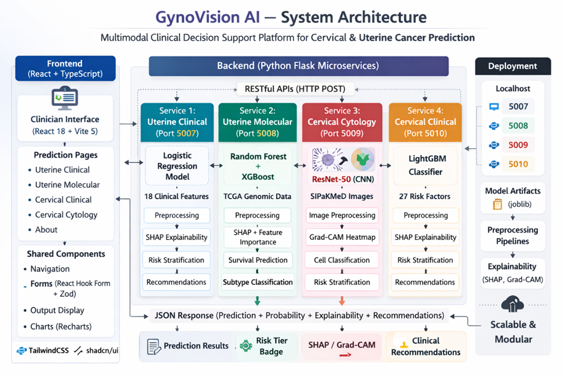

<p align="center">
  
  
  
  
  
  
  
</p>

<h1 align="center">🧬 GynoVision AI Suite</h1>

<p align="center">
  <strong>AI-Powered Multimodal Gynecological Cancer Decision Support Platform</strong>
</p>

<p align="center">
  A full-stack clinical decision support system that integrates <strong>clinical risk prediction</strong>, <strong>TCGA molecular prognostics</strong>, and <strong>deep learning image analysis</strong> into a unified platform for gynecological cancer assessment.
</p>

---

## 📋 Table of Contents

- [Overview](#-overview)
- [Key Features](#-key-features)
- [Architecture](#-architecture)
- [AI Modules](#-ai-modules)
  - [Module 1 — Uterine Cancer Clinical Prediction](#module-1--uterine-cancer-clinical-prediction)
  - [Module 2 — Uterine Cancer Molecular (TCGA)](#module-2--uterine-cancer-molecular-tcga)
  - [Module 3 — Cervical Cancer Clinical Prediction](#module-3--cervical-cancer-clinical-prediction)
  - [Module 4 — Cervical Cytology Image Classification](#module-4--cervical-cytology-image-classification)
- [Tech Stack](#-tech-stack)
- [Project Structure](#-project-structure)
- [Getting Started](#-getting-started)
  - [Prerequisites](#prerequisites)
  - [Frontend Setup](#1-frontend-setup)
  - [Backend Setup](#2-backend-setup)
- [API Reference](#-api-reference)
- [Datasets Used](#-datasets-used)
- [Explainability & Interpretability](#-explainability--interpretability)
- [PDF Report Generation](#-pdf-report-generation)
- [Disclaimer](#%EF%B8%8F-disclaimer)
- [License](#-license)

---

## 🌟 Overview

**GynoVision AI** is a multimodal artificial intelligence platform designed to assist healthcare professionals in gynecological cancer assessment. The platform combines four distinct AI modules — each powered by different machine learning paradigms — into a single, cohesive web application with a modern, visually rich interface.

The system is built as a **final-year academic research project** that demonstrates the potential of AI in clinical decision support for:

- **Uterine (Endometrial) Cancer** — Clinical risk scoring and TCGA-based molecular subtype classification
- **Cervical Cancer** — Clinical risk stratification and CNN-powered Pap smear cytology image classification

> ⚠️ **Important:** This is a research prototype and has **not** been clinically validated. It is intended for academic and educational demonstration purposes only.

---

## ✨ Key Features

| Feature | Description |
|---|---|
| **4 AI Modules** | Clinical + Molecular + Imaging pipelines across two cancer types |
| **Risk Stratification** | Color-coded Low / Intermediate / High risk tiers with calibrated thresholds |
| **SHAP Explainability** | Per-prediction feature importance with direction indicators |
| **Grad-CAM Visualization** | Heatmap overlays showing which image regions drive CNN predictions |
| **LLM Decision Support** | Dynamic, Gemini LLM-generated clinical interpretations and actionable advice tailored to each patient's risk profile |
| **PDF Report Generation** | Downloadable, professionally formatted patient reports from every module |
| **Modern Dark UI** | Glassmorphism, Framer Motion animations, particle effects, and responsive design |
| **Modular Backend** | Each model runs as an independent Flask microservice on its own port |

---

## 🏗 Architecture

The platform follows a **decoupled frontend-backend architecture** where the React frontend communicates with four independent Flask API servers:



---

## 🤖 AI Modules

### Module 1 — Uterine Cancer Clinical Prediction

| Aspect | Details |
|---|---|
| **Route** | `/uterine-clinical` |
| **Backend** | `backend/uterine-cancer-model/app.py` — Port **5007** |
| **Model** | Logistic Regression (Calibrated) with Class Weighting |
| **Explainability** | SHAP / Coefficient-based per-sample feature contributions |
| **Input Features** | 18 clinical parameters |

**Clinical Input Parameters:**

| Category | Fields |
|---|---|
| Demographics | Age, BMI, Menopause Status |
| Symptoms | Abnormal Bleeding, Pelvic Pain, Vaginal Discharge, Unexplained Weight Loss |
| Clinical Measurements | Endometrial Thickness (mm), CA-125 Level (U/mL) |
| Medical History | Hypertension, Diabetes, Family History of Cancer, Smoking, Estrogen Therapy |
| Pathology & Reproductive | Histology Type, Parity, Gravidity, Hormone Receptor Status |

**Output:**
- Probability score (0–100%)
- Risk tier: **Low** (< calibrated threshold) / **Intermediate** / **High** (≥ calibrated threshold)
- Top 5 SHAP feature contributions with direction indicators
- Context-aware clinical recommendations (rule-based engine considering combinations of risk factors)

---

### Module 2 — Uterine Cancer Molecular (TCGA)

| Aspect | Details |
|---|---|
| **Route** | `/uterine-molecular` |
| **Backend** | `backend/uterine-cancer-TCGA-model/app.py` — Port **5008** |
| **Task A Model** | Random Forest — Molecular subtype classification |
| **Task B Model** | XGBoost — Survival outcome prediction |
| **Explainability** | SHAP TreeExplainer |

**Input Features (6 Genomic + Clinical):**

| Feature | Example Value |
|---|---|
| Mutation Count | 65 |
| Fraction Genome Altered | 0.3311 |
| MSI MANTIS Score | 0.3234 |
| MSIsensor Score | 0.85 |
| Diagnosis Age | 59 |
| Race / Ethnicity | White, Black or African American, Asian, etc. |

**Pipeline:**
1. One-hot encode Race Category
2. Impute missing values → Scale features
3. PCA-merge MSI MANTIS + MSIsensor → `MSI_PC1`
4. Predict molecular subtype (Task A) and survival outcome (Task B)

**Output:**
- **Molecular Subtype** with confidence score and class probabilities
- **Survival Risk**: Living / Deceased prediction with probability and risk tier (Low / Intermediate / High)
- Top 5 SHAP feature explanations

---

### Module 3 — Cervical Cancer Clinical Prediction

| Aspect | Details |
|---|---|
| **Route** | `/cervical-clinical` |
| **Backend** | `backend/cervical-cancer-clinical-model/app.py` — Port **5010** |
| **Model** | Calibrated LightGBM (CalibratedClassifierCV) |
| **Explainability** | SHAP TreeExplainer |

**Input Features (28 Clinical Parameters):**

| Section | Fields |
|---|---|
| Demographics & Lifestyle | Age, Number of Sexual Partners, First Sexual Intercourse (age), Pregnancies, Smoking status/duration/intensity |
| Contraception & IUD | Hormonal Contraceptives (yes/no + years), IUD (yes/no + years) |
| STD History | 13 specific STD types (HIV, HPV, Hepatitis B, AIDS, etc.), total count, time since first/last diagnosis |

**Custom Preprocessing Pipeline:**
- `STDAtomicTransformer` — Imputes STD fields, engineers `Any_STD`, `STD_Burden`, `High_Risk_STD` summary features
- `MissingnessIndicatorTransformer` — Creates binary missing indicators
- `GeneralImputerTransformer` — Median/mode imputation
- `ColumnNameSanitizer` — Normalizes column names
- `RobustScalerTransformer` — Scales numeric features

**Output:**
- Cancer probability with dual-threshold risk classification (T1, T2)
- Risk label: **Low Risk** / **Moderate Risk** / **High Risk**
- SHAP-based top contributing factors
- Clinical Decision Support guidance with specific actionable recommendations

---

### Module 4 — Cervical Cytology Image Classification

| Aspect | Details |
|---|---|
| **Route** | `/cervical-cytology` |
| **Backend** | `backend/cervical-cancer-resnet50-model/model_server.py` — Port **5009** |
| **Model** | FastAI ResNet-50 (pre-trained, fine-tuned) |
| **Visualization** | Grad-CAM (Gradient-weighted Class Activation Mapping) |

**Cell Types Classified (5 classes):**

| Cell Type | Clinical Significance |
|---|---|
| **Dyskeratotic** | Abnormal keratinization — may indicate dysplasia or malignancy |
| **Koilocytotic** | HPV-associated cytopathic changes — warrants follow-up |
| **Metaplastic** | Squamous metaplasia — usually benign transformation |
| **Parabasal** | Parabasal cells — seen in atrophy or regeneration |
| **Superficial-Intermediate** | Normal mature squamous cells |

**Input:** Pap smear cytology image (`.jpg`, `.jpeg`, `.png`, `.bmp`, `.tif`, `.tiff`)

**Output:**
- Predicted cell type with confidence score
- Per-class probability distribution
- **Grad-CAM heatmap overlay** — Highlights the image regions most influential to the model's prediction
- Clinical recommendations based on cell type classification

---

## 💻 Tech Stack

### Frontend

| Technology | Purpose |
|---|---|
| [React 18](https://react.dev) | UI framework |
| [TypeScript](https://www.typescriptlang.org) | Type-safe JavaScript |
| [Vite 5](https://vitejs.dev) | Build tool and dev server |
| [TailwindCSS 3](https://tailwindcss.com) | Utility-first CSS |
| [shadcn/ui](https://ui.shadcn.com) | Radix-based UI component library |
| [Framer Motion](https://www.framer.com/motion) | Animations and transitions |
| [React Router v6](https://reactrouter.com) | Client-side routing |
| [TanStack Query](https://tanstack.com/query) | Async state management |
| [Recharts](https://recharts.org) | Charting library |
| [jsPDF](https://github.com/parallax/jsPDF) | Client-side PDF report generation |
| [Zod](https://zod.dev) | Schema validation |
| [Lucide React](https://lucide.dev) | Icon library |

### Backend

| Technology | Purpose |
|---|---|
| [Flask](https://flask.palletsprojects.com) | Lightweight Python web framework |
| [Flask-CORS](https://flask-cors.readthedocs.io) | Cross-Origin Resource Sharing |
| [scikit-learn](https://scikit-learn.org) | ML models (LR, RF, pipelines) |
| [LightGBM](https://lightgbm.readthedocs.io) | Gradient boosted decision trees |
| [XGBoost](https://xgboost.readthedocs.io) | Extreme gradient boosting |
| [FastAI](https://docs.fast.ai) | Deep learning framework (ResNet-50) |
| [PyTorch](https://pytorch.org) | Tensor computation and neural networks |
| [SHAP](https://shap.readthedocs.io) | SHapley Additive exPlanations |
| [Pandas](https://pandas.pydata.org) / [NumPy](https://numpy.org) | Data manipulation |
| [Joblib](https://joblib.readthedocs.io) | Model serialization |
| [Google Gemini API](https://deepmind.google/technologies/gemini/) | LLM for dynamic clinical recommendations |

---

## 📁 Project Structure

```
gynovision-ai-suite/
│
├── src/                              # Frontend source code
│   ├── App.tsx                       # Root component with routing
│   ├── main.tsx                      # Entry point
│   ├── index.css                     # Global styles & design tokens
│   ├── pages/
│   │   ├── Index.tsx                 # Landing / hero page
│   │   ├── UterineClinical.tsx       # Uterine cancer clinical form + results
│   │   ├── UterineMolecular.tsx      # TCGA molecular subtype form + results
│   │   ├── CervicalClinical.tsx      # Cervical cancer clinical form + results
│   │   ├── CervicalCytology.tsx      # Image upload + CNN classification + Grad-CAM
│   │   ├── About.tsx                 # About page with project info
│   │   └── NotFound.tsx              # 404 page
│   ├── components/
│   │   ├── Navbar.tsx                # Top navigation bar
│   │   ├── Footer.tsx                # Footer with module links
│   │   ├── GlassCard.tsx             # Glassmorphism card component
│   │   ├── ParticleField.tsx         # Animated particle background
│   │   ├── DNAHelix.tsx              # Decorative DNA helix animation
│   │   ├── PageHeader.tsx            # Reusable page header
│   │   ├── DisclaimerBox.tsx         # Medical disclaimer component
│   │   ├── ClinicalRecommendation.tsx# Cytology-based recommendations
│   │   ├── ImageUploadZone.tsx       # Drag-and-drop image uploader
│   │   ├── RiskBadge.tsx             # Risk tier badge component
│   │   ├── ConfidenceBar.tsx         # Animated confidence bar
│   │   ├── MolecularBadge.tsx        # Molecular subtype badge
│   │   ├── NavLink.tsx               # Navigation link component
│   │   ├── ScrollToTop.tsx           # Scroll restoration on route change
│   │   └── ui/                       # shadcn/ui primitives
│   ├── utils/
│   │   ├── generateUterineReport.ts          # Uterine clinical PDF generator
│   │   ├── generateMolecularReport.ts        # Molecular TCGA PDF generator
│   │   ├── generateCervicalReport.ts         # Cervical cytology PDF generator
│   │   └── generateCervicalClinicalReport.ts # Cervical clinical PDF generator
│   ├── hooks/
│   │   ├── use-mobile.tsx            # Mobile breakpoint detection
│   │   └── use-toast.ts             # Toast notification hook
│   └── lib/                          # Utility functions
│
├── backend/
│   ├── uterine-cancer-model/         # Port 5007 — Logistic Regression
│   │   ├── app.py                    # Flask API server
│   │   ├── models/                   # Serialized model artifacts
│   │   └── requirements.txt
│   │
│   ├── uterine-cancer-TCGA-model/    # Port 5008 — RF + XGBoost
│   │   ├── app.py                    # Flask API server
│   │   ├── model_artifacts/          # Serialized model artifacts
│   │   └── requirements.txt
│   │
│   ├── cervical-cancer-resnet50-model/ # Port 5009 — FastAI ResNet-50
│   │   ├── model_server.py           # Flask API server
│   │   ├── models/                   # Serialized model artifacts (export.pkl)
│   │   └── requirements.txt
│   │
│   └── cervical-cancer-clinical-model/ # Port 5010 — Calibrated LightGBM
│       ├── app.py                    # Flask API server
│       ├── models/                   # Serialized model artifacts
│       └── requirements.txt
│
├── public/                           # Static assets
├── index.html                        # HTML entry point
├── package.json                      # Node.js dependencies
├── vite.config.ts                    # Vite configuration
├── tailwind.config.ts                # Tailwind CSS configuration
├── tsconfig.json                     # TypeScript configuration
└── README.md                         # This file
```

---

## 🚀 Getting Started

### 🐳 The Easy Way (Docker - Recommended)

The entire application (frontend + 4 backends) is fully containerized. You can launch the entire ecosystem with a single command!

**Prerequisites:**
- [Docker Desktop](https://www.docker.com/products/docker-desktop/) installed and running.

**Steps:**
1. Clone the repository:
   ```bash
   git clone https://github.com/Sanjay0629/gynovision-ai-suite.git
   cd gynovision-ai-suite
   ```

2. Start the entire suite:
   ```bash
   # Option A: Windows Users (builds and opens browser automatically)
   start.bat

   # Option B: Mac/Linux Users (builds and opens browser automatically)
   bash start.sh

   # --- OR ---

   # Option C: Using Docker Compose manually
   docker compose up -d --build
   ```

The frontend will be instantly available at **http://localhost** and all 4 backends will be securely routed internally!

---

### 💻 The Manual Way (Local Development)

<details>
<summary>Click here to expand manual setup instructions</summary>

**Prerequisites:**
- **Node.js** ≥ 18.x and **npm**
- **Python** ≥ 3.10

#### 1. Frontend Setup

```bash
# Clone the repository
git clone https://github.com/Sanjay0629/gynovision-ai-suite.git
cd gynovision-ai-suite

# Install frontend dependencies
npm install

# Start the development server
npm run dev
```

The frontend will be available at **`http://localhost:8080`**.

#### 2. Backend Setup

Each backend module runs independently. Set up each one in its own terminal:

**Module 1 — Uterine Cancer Clinical (Port 5007)**
```bash  
cd backend/uterine-cancer-model
python -m venv venv
venv\Scripts\activate       # or source venv/bin/activate
pip install -r requirements.txt
python app.py
```

**Module 2 — Uterine Molecular TCGA (Port 5008)**
```bash
cd backend/uterine-cancer-TCGA-model
python -m venv venv
venv\Scripts\activate       # or source venv/bin/activate
pip install -r requirements.txt
python app.py
```

**Module 3 — Cervical Cytology Imaging (Port 5009)**
```bash
cd backend/cervical-cancer-resnet50-model
python -m venv venv
venv\Scripts\activate       # or source venv/bin/activate
pip install -r requirements.txt
python model_server.py
```

**Module 4 — Cervical Cancer Clinical (Port 5010)**
```bash
cd backend/cervical-cancer-clinical-model
python -m venv venv
venv\Scripts\activate       # or source venv/bin/activate
pip install -r requirements.txt
python app.py
```

</details>

---

## 📡 API Reference

### Uterine Clinical — Port 5007

| Method | Endpoint | Description |
|---|---|---|
| `GET` | `/health` | Health check and model status |
| `GET` | `/model-info` | Model metadata, features, thresholds, and limitations |
| `POST` | `/predict/uterine` | Submit 18 clinical features → risk prediction |

### Uterine Molecular TCGA — Port 5008

| Method | Endpoint | Description |
|---|---|---|
| `GET` | `/health` | Health check |
| `GET` | `/model-info` | Model metadata and available subtypes |
| `POST` | `/predict/uterine-tcga` | Submit 6 genomic/clinical features → subtype + survival prediction |

### Cervical Cytology — Port 5009

| Method | Endpoint | Description |
|---|---|---|
| `GET` | `/health` | Health check and model classes |
| `POST` | `/predict/cervical` | Upload Pap smear image (multipart/form-data) → cell classification + Grad-CAM |

### Cervical Clinical — Port 5010

| Method | Endpoint | Description |
|---|---|---|
| `GET` | `/health` | Health check |
| `POST` | `/predict` | Submit 28 clinical features → cancer probability + risk label |

---

## 📊 Datasets Used

| Dataset | Cancer Type | Usage |
|---|---|---|
| **TCGA-UCEC** | Uterine (Endometrial) | Molecular subtype classification and survival analysis |
| **SipakMed** | Cervical | Pap smear cytology image classification (5 cell types) |
| **Clinical Registry Data** | Cervical | Risk factor-based cervical cancer screening prediction |
| **Synthetic Clinical Data** | Uterine | Clinical risk prediction model training |

---

## 🔍 Explainability & Interpretability

The platform prioritizes **transparent, interpretable AI** through multiple explainability mechanisms:

### SHAP (SHapley Additive exPlanations)
Used across all clinical models to provide per-prediction feature importance:
- **TreeExplainer** for tree-based models (LightGBM, XGBoost, Random Forest)
- **Coefficient-based contributions** for linear models (Logistic Regression)
- Each prediction shows the top 5 features with magnitude and direction (increases/decreases risk)

### Grad-CAM (Gradient-weighted Class Activation Mapping)
Used in the cytology image classification module:
- Hooks into the last convolutional block (**layer4**) of the ResNet-50 backbone
- Produces a heatmap overlay on the original image highlighting the regions most influential to the prediction
- Based on *Selvaraju et al., 2017*

### Clinical Decision Support (CDS)
LLM-powered dynamic recommendation engine (integrated Gemini API):
- Provides real-time clinical interpretations and actionable next steps based on the patient's individual risk profile, test results, and model predictions.
- **Dynamic & Personalized**: Replaces static rule-based systems with comprehensive, context-aware guidance tailored to the complete clinical picture.

---

## 📄 PDF Report Generation

Every AI module supports **downloadable PDF reports** generated entirely client-side using **jsPDF**. Reports include:

- **Patient Information** — Name, ID, Age (optional fields)
- **Clinical Input Summary** — All submitted form data
- **Prediction Results** — Risk tier, probability scores, confidence levels
- **SHAP Explanation** — Top contributing features with direction
- **LLM Clinical Recommendations** — Dynamic, AI-generated clinical interpretations and actionable guidance
- **Grad-CAM Images** — Embedded heatmap visualization (cytology module)
- **Disclaimer** — Academic research notice

Report generators are located in:
- `src/utils/generateUterineReport.ts`
- `src/utils/generateMolecularReport.ts`
- `src/utils/generateCervicalReport.ts`
- `src/utils/generateCervicalClinicalReport.ts`

---

## ⚖️ Disclaimer

> **GynoVision AI** is developed for **academic research and educational demonstration purposes only**. It is **not** intended for clinical deployment without proper regulatory approval and clinical validation.
>
> - All predictions are generated by machine learning models and **must be interpreted by qualified medical professionals**.
> - The system emphasizes **decision support, not autonomous diagnosis**.
> - Some models are trained on synthetic or limited datasets and may not generalize to all populations.
> - SHAP explanations are approximate and may vary with background data.
> - **Always defer to clinical judgment.**

---

## 📝 License

This project is intended for **academic and research use only**.

© 2026 GynoVision AI. Built for clinical research.
